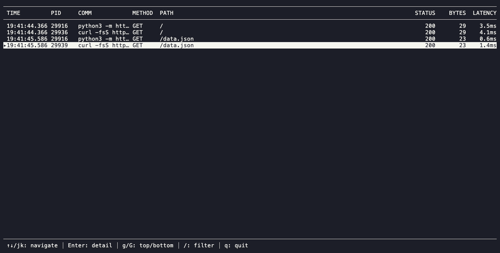

# tinytap

> A tiny eBPF-based HTTP traffic capture tool for local development.



The `--output tui` mode above shows the live request table (`j`/`k` to scroll),
the detail panel (`Enter` to open, `b` to toggle the hex body view). Regenerate
it with `vhs scripts/tinytap.tape` from the Mac host — see
[`docs/recording-tui-gifs.md`](docs/recording-tui-gifs.md) for the full
hand-off procedure.

## What it does today

`tinytap` attaches eBPF probes to a process's socket syscalls
(`accept4`/`read`/`write`/`close`/`recvfrom`/`sendto`/`recvmsg`/`sendmsg`),
parses the payload bytes as HTTP/1.1, pairs each request with its response,
and renders the exchange live — either in the terminal TUI above or as a
line-oriented stream:

```
12:47:57.005  python3[27122]  GET   /                        200    1304B     0.3ms
12:47:57.005  curl[1234]       GET   /api                     ABANDONED     12.3ms  (peer closed)
```

`--output auto` (the default) picks the TUI on an interactive terminal and
falls back to the line stream otherwise; `--output stdout` / `--output tui`
force one or the other, and `-v` / `--verbose` hangs the full request/response
headers under each stdout line.

## Current limitations

- HTTP/1.1 only — no HTTP/2, gRPC, or other protocols yet
- No TLS/HTTPS support yet (plaintext HTTP only)
- Single host — no cross-container attribution or cross-service correlation yet
- Response bodies are sampled up to a fixed per-syscall cap, not captured in full (see [`docs/server-compat.md`](docs/server-compat.md) for exactly how each server's syscall pattern affects this)
- `sendfile`-based transfers are only sampled on arm64 today (x86_64 tracked in #112)

See [`docs/server-compat.md`](docs/server-compat.md) for a server-by-server breakdown of what's currently visible.

## Quick start

Build and run inside the Lima VM (see [Toolchain](#toolchain) below for setup):

```bash
# Regenerate Go bindings from C (only needed after editing bpf/*.c)
cd ~/tinytap/internal/loader/bpf && go generate

# Build
cd ~/tinytap && go build ./...

# Run (requires root — eBPF needs CAP_BPF/CAP_PERFMON or root)
sudo ./tinytap
```

Or via `make`:

```bash
make run       # orchestrated smoke test: starts a demo HTTP server, fires a request, shows the capture
make run-raw   # build + run with --output stdout against whatever's already running
```

Run `make install` once per checkout (or worktree) to install the pre-push
hook that runs lint, tests, and coverage checks before every push.

## Where tinytap Runs

There are two distinct environments to keep in mind, and they answer two different questions.

### Where tinytap is *built and developed*

The development environment is **Mac + Lima + Ubuntu VM**, because eBPF only exists on Linux. See [Toolchain](#toolchain) for setup. This is private to the maintainer's workflow — it does not constrain users.

### Where tinytap is *executed*

**tinytap requires a Linux kernel.** It cannot run natively on macOS or Windows, because eBPF is a Linux kernel technology. But that's less restrictive than it sounds, because Linux kernels are everywhere:

| Where the user works | How tinytap runs there |
|---|---|
| Linux desktop / laptop / workstation | Native. Just run the binary. |
| Linux server (cloud VM, on-prem, dev box) | Native. SSH in, run it. |
| Mac (Intel or Apple Silicon) | Inside a Linux VM — Lima, Multipass, OrbStack, UTM, Docker Desktop's VM, etc. |
| Windows | Inside WSL2 (which is a real Linux kernel). |

This pattern — "Mac/Win developers run this through a Linux VM" — is the standard for eBPF tooling in general (bpftrace, Cilium, etc.). tinytap is not unusual here.

### Containers are friends, not enemies

A common question: "if my dev stack runs in Docker on my Mac, can tinytap see inside the containers?"

**Yes.** A Docker container is just a process (or process tree) running on the host's Linux kernel, isolated by namespaces and cgroups. eBPF programs attach to kernel events — syscalls, kprobes, tracepoints — which fire for *all* processes, container or not. So:

```
Mac
└── Lima VM (Ubuntu)        ← tinytap runs here
    ├── tinytap (Go binary, sudo)
    └── Docker daemon
        ├── container: api-service
        ├── container: db
        └── container: cache
```

...tinytap, running in the VM as root, observes syscalls from the containerized processes too — the same way it would for a process running directly on the VM. This is the same reason `htop` on the host shows container processes: they're all just kernel processes.

For the user, this means **tinytap doesn't need to be installed inside containers**, doesn't need a sidecar, and doesn't require the application to be rebuilt with anything. One install on the host is enough.

(Container-aware *attribution* — turning a PID into "this is the api-service container" — is a planned feature, not yet built. The kernel sees the PIDs; mapping them back to container names requires reading from Docker/containerd. For now tinytap shows raw PIDs.)

### Requirements

- Linux kernel 5.4+ (ringbuf support; may bump to 5.8+ — see [Toolchain](#toolchain))
- macOS/Windows users run tinytap inside a Linux VM (Lima, WSL2, etc.) — there is no native macOS/Windows build and none is planned, since eBPF is Linux-only

## Status & Roadmap

Released so far: `v0.1.0` (HTTP request/response visible), `v0.2.0` (Bubble Tea TUI), `v0.3.0` (filtering + test foundation). `v0.4.0` (server capture & compatibility) is in progress — see [`docs/server-compat.md`](docs/server-compat.md) for the current per-server matrix.

Full roadmap (near-term steps and longer-term vision) lives in [#19](https://github.com/shinagawa-web/tinytap/issues/19), kept out of the README so this stays focused on what tinytap does today.

## Toolchain

| Component | Choice | Why |
|---|---|---|
| eBPF lib | `github.com/cilium/ebpf` | Pure Go, modern, standard for new projects |
| Build | `bpf2go` (part of cilium/ebpf) | Generates Go bindings from C code |
| Compiler | `clang` 14+ | Standard for eBPF, supports BTF |
| Go | 1.24+ | |
| Kernel | Linux 5.4+ | Common on modern Ubuntu, has BTF; ringbuf available 5.8+ |
| Architecture | amd64 + arm64 | Need arm64 for Apple Silicon Lima VM |

### Dev environment

Mac (Apple Silicon) + Lima with Ubuntu 24.04. Build and run inside the Lima VM. Edit code on Mac via VS Code's remote SSH or the auto-mounted filesystem.

Setup commands:

```bash
# Mac side
brew install lima
limactl start --name=tinytap template://ubuntu
limactl shell tinytap

# Inside the VM
sudo apt update
sudo apt install -y clang llvm libbpf-dev linux-headers-$(uname -r) \
  build-essential git pkg-config

# Go (apt version is old)
GO_VERSION=1.24.0
ARCH=$(dpkg --print-architecture)  # arm64 on Apple Silicon
wget https://go.dev/dl/go${GO_VERSION}.linux-${ARCH}.tar.gz
sudo tar -C /usr/local -xzf go${GO_VERSION}.linux-${ARCH}.tar.gz
echo 'export PATH=$PATH:/usr/local/go/bin' >> ~/.bashrc
source ~/.bashrc
```

## License

MIT. The repository doesn't have a `LICENSE` file checked in yet — tracked as a follow-up.

## References

- [cilium/ebpf examples](https://github.com/cilium/ebpf/tree/main/examples) — primary reference for the Go side
- [hengyoush/kyanos](https://github.com/hengyoush/kyanos) — reference for HTTP capture implementation patterns
- [mozillazg/ptcpdump](https://github.com/mozillazg/ptcpdump) — reference for process-awareness patterns
- [Pixie blog: Debugging with eBPF Part 2](https://blog.px.dev/ebpf-http-tracing/) — the canonical "tracing HTTP via syscalls" walkthrough
- [eunomia eBPF tutorials](https://eunomia.dev/) — readable, hands-on
- Brendan Gregg's blog — for the kernel-side mental model
