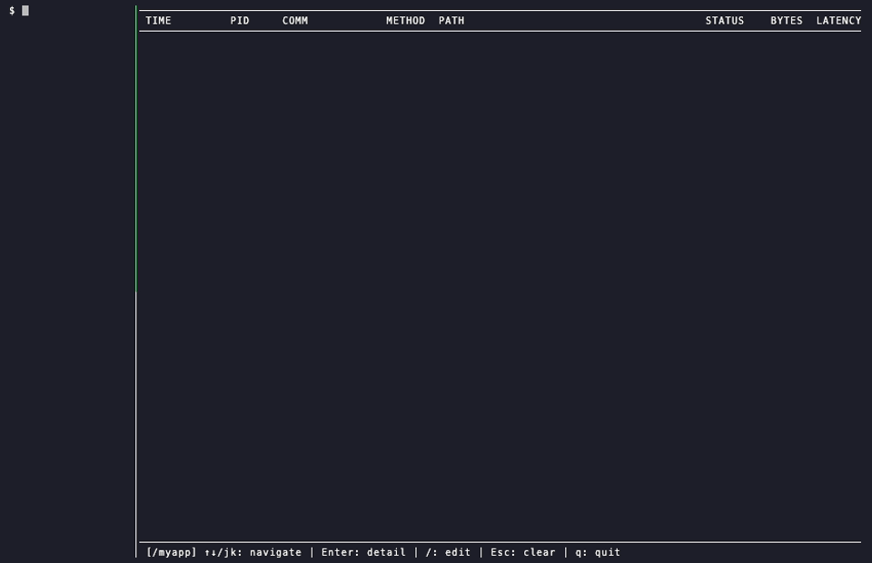

# tinytap

[](https://securityscorecards.dev/viewer/?uri=github.com/shinagawa-web/tinytap)

> A tiny eBPF-based HTTP traffic capture tool for local development.



The TUI mode shown above (`output = "tui"` in the config file — see
[Configuration](#configuration)) shows the live request table (`j`/`k` to
scroll), the detail panel (`Enter` to open, `b` to toggle the hex body view).
Regenerate it with `vhs scripts/tinytap.tape` from the Mac host — see
[`docs/recording-tui-gifs.md`](docs/recording-tui-gifs.md) for the full
hand-off procedure.

## Quick start

Install a released binary — no Go toolchain or clang/libbpf-dev needed:

```bash
curl -fsSL https://raw.githubusercontent.com/shinagawa-web/tinytap/main/scripts/install.sh | sh
```

Detects Linux amd64/arm64 (failing loudly on anything else, e.g. macOS/Windows
— see [Where tinytap Runs](#where-tinytap-runs)), downloads the matching
[release](https://github.com/shinagawa-web/tinytap/releases) archive,
verifies its SHA-256 checksum against the release's `checksums.txt`, and
installs `tinytap` to `/usr/local/bin` (falling back to `sudo` if that isn't
writable). Two env vars change its behavior:

- `TINYTAP_VERSION=v0.6.1` — pin a specific release instead of the latest
- `INSTALL_DIR=~/bin` — install somewhere other than `/usr/local/bin`

Then run it:

```bash
sudo tinytap
```

Root isn't actually required — see [Running without full root](#running-without-full-root)
for the minimal `setcap` invocation. Building from source instead (e.g. for
development)? See [Building from source](#building-from-source).

### Verifying a release download

Every [tagged release](https://github.com/shinagawa-web/tinytap/releases)
publishes, alongside the `linux_amd64`/`linux_arm64` archives:

- `checksums.txt` — SHA-256 of every archive and SBOM in the release
- `checksums.txt.sigstore.json` — a keyless [cosign](https://docs.sigstore.dev/cosign/overview/)
  signature over `checksums.txt`, minted from the release workflow's own
  GitHub Actions OIDC identity (no private key is stored anywhere)
- `<archive>.sbom.json` — an SBOM for each archive ([syft](https://github.com/anchore/syft),
  SPDX format)

The install script above only verifies the SHA-256 checksum. To verify the
full chain of trust manually:

```bash
sha256sum --check --ignore-missing checksums.txt
```

Verify `checksums.txt` itself was produced by tinytap's release workflow
(requires [cosign](https://docs.sigstore.dev/cosign/system_config/installation/) v3+):

```bash
cosign verify-blob \
  --bundle checksums.txt.sigstore.json \
  --certificate-identity-regexp "^https://github.com/shinagawa-web/tinytap/\.github/workflows/release\.yml@refs/tags/v.*" \
  --certificate-oidc-issuer https://token.actions.githubusercontent.com \
  checksums.txt
```

Since every archive and SBOM is listed by digest inside `checksums.txt`,
a passing `cosign verify-blob` on `checksums.txt` plus a passing
`sha256sum --check` on the archive establishes the whole chain: this exact
archive came from this exact release workflow run.

## What it does today

`tinytap` attaches eBPF probes to a process's socket syscalls
(`accept4`/`read`/`write`/`close`/`recvfrom`/`sendto`/`recvmsg`/`sendmsg`),
parses the payload bytes as HTTP/1.1, pairs each request with its response,
and renders the exchange live — either in the terminal TUI above or as a
line-oriented stream:

```
12:47:57.005  python3[27122]  GET   /                        200    1304B     0.3ms
12:47:57.005  curl[1234]       GET   /api                     ABANDONED     12.3ms  (peer closed)
```

`output = "auto"` (the default) picks the TUI when stdout/stdin are an
interactive terminal of at least 120x24; otherwise it prints guidance and
exits rather than silently streaming — the line stream is opt-in via
`output = "stdout"`. `output = "tui"` forces the TUI (and exits the same way
if the terminal can't host it); `verbose = true` hangs the full
request/response headers under each stdout line. `--version` prints the
build's version, commit, and date, and exits without needing root.

## Configuration

Session settings (`output`, `verbose`, and process filters) live in a TOML
config file, not CLI flags. `tinytap config init` writes one, fully populated
with defaults, so `tinytap config init && tinytap` just works:

```bash
tinytap config init          # writes ./tinytap.toml
tinytap config init path/to/config.toml   # or a specific path
tinytap config init --force  # overwrite an existing file
```

Search order when `--config <path>` isn't given:
`./tinytap.toml`, then `$XDG_CONFIG_HOME/tinytap/config.toml` (falling back
to `~/.config/tinytap/config.toml`) — finding neither is not an error, the
defaults below apply.

```toml
output = "auto"   # auto | stdout | tui
verbose = false

[filter]
pid  = []         # []uint32 — schema only, not yet enforced by the BPF program (#211)
comm = []         # []string — schema only, not yet enforced by the BPF program (#211)
```

The only CLI surface is one-shot actions, not session settings: `--config
<path>` (point at an alternate config file), `--version` (build metadata,
exits before any eBPF load), `config init` (above), and `doctor` (below).

### Diagnosing startup problems

`tinytap doctor` runs read-only preflight checks — kernel version, BTF
availability, the capabilities in [`docs/capabilities.md`](docs/capabilities.md),
syscall tracepoint availability, a dry-run BPF load, and the host's libssl
execute bit — and prints a copy-paste-friendly report, without needing
root or capabilities itself:

```bash
tinytap doctor
```

Each result is classified by what it actually costs: a **blocking** result
means tinytap can't run at all (e.g. a kernel below the 5.8 floor); a
**degraded** result means tinytap runs but one specific capability is lost
(e.g. no TLS capture without `cap_sys_admin`) — it's never printed as if
something were broken. `doctor` exits non-zero only when a blocking result
is present, so `tinytap doctor && tinytap` is a reasonable way to run it. A
normal startup failure also names the specific blocking cause instead of
only a raw error, pointing at `tinytap doctor` for the full picture.

## Current limitations

- HTTP/1.1 only — no HTTP/2, gRPC, or other protocols yet
- TLS capture needs a dynamically linked `libssl.so`, so statically linked TLS stacks are invisible — that includes Go's `crypto/tls` and therefore Go-based proxies like Traefik and Caddy. Clients that hand OpenSSL a custom `BIO` instead of calling `SSL_set_fd` (e.g. curl) are captured and paired, but keyed on the `SSL*` pointer rather than a socket fd, so their exchanges are marked `[ssl-keyed, fd unverified]` — see [`docs/tls-compat.md`](docs/tls-compat.md)
- Single host — no cross-container attribution or cross-service correlation yet
- Response bodies are sampled up to a fixed per-syscall cap, not captured in full (see [`docs/server-compat.md`](docs/server-compat.md) for exactly how each server's syscall pattern affects this)
- `sendfile`-based transfers only carry payload bytes on amd64/arm64 — other architectures see the exchange but not the sampled body

See [`docs/server-compat.md`](docs/server-compat.md) for a server-by-server breakdown of what's currently visible.

## Where tinytap Runs

There are two distinct environments to keep in mind, and they answer two different questions.

### Where tinytap is *built and developed*

The development environment is **Mac + Lima + Ubuntu VM**, because eBPF only exists on Linux. See [Toolchain](#toolchain) for setup. This is private to the maintainer's workflow — it does not constrain users.

### Where tinytap is *executed*

**tinytap requires a Linux kernel.** It cannot run natively on macOS or Windows, because eBPF is a Linux kernel technology. But that's less restrictive than it sounds, because Linux kernels are everywhere:

| Where the user works | How tinytap runs there |
|---|---|
| Linux desktop / laptop / workstation | Native. Just run the binary. |
| Linux server (cloud VM, on-prem, dev box) | Native. SSH in, run it. |
| Mac (Intel or Apple Silicon) | Inside a Linux VM — Lima, Multipass, OrbStack, UTM, Docker Desktop's VM, etc. |
| Windows | Inside WSL2 (which is a real Linux kernel). |

This pattern — "Mac/Win developers run this through a Linux VM" — is the standard for eBPF tooling in general (bpftrace, Cilium, etc.). tinytap is not unusual here.

### Containers are friends, not enemies

A common question: "if my dev stack runs in Docker on my Mac, can tinytap see inside the containers?"

**Yes.** A Docker container is just a process (or process tree) running on the host's Linux kernel, isolated by namespaces and cgroups. eBPF programs attach to kernel events — syscalls, kprobes, tracepoints — which fire for *all* processes, container or not. So:

```
Mac
└── Lima VM (Ubuntu)        ← tinytap runs here
    ├── tinytap (Go binary, sudo)
    └── Docker daemon
        ├── container: api-service
        ├── container: db
        └── container: cache
```

...tinytap, running in the VM as root, observes syscalls from the containerized processes too — the same way it would for a process running directly on the VM. This is the same reason `htop` on the host shows container processes: they're all just kernel processes.

For the user, this means **tinytap doesn't need to be installed inside containers**, doesn't need a sidecar, and doesn't require the application to be rebuilt with anything. One install on the host is enough.

(Container-aware *attribution* — turning a PID into "this is the api-service container" — is a planned feature, not yet built. The kernel sees the PIDs; mapping them back to container names requires reading from Docker/containerd. For now tinytap shows raw PIDs.)

### Requirements

- Linux kernel 5.8+ (tinytap's event transport is `BPF_MAP_TYPE_RINGBUF`, added in 5.8 — see [Toolchain](#toolchain))
- macOS/Windows users run tinytap inside a Linux VM (Lima, WSL2, etc.) — there is no native macOS/Windows build and none is planned, since eBPF is Linux-only

### Running without full root

`sudo ./tinytap` is the simplest path, but tinytap doesn't need full root.
Plaintext HTTP capture needs three Linux capabilities:

```bash
sudo setcap cap_dac_read_search,cap_perfmon,cap_bpf=eip ./tinytap
./tinytap
```

TLS capture (the libssl uprobes) needs one more, `cap_sys_admin`:

```bash
sudo setcap cap_dac_read_search,cap_perfmon,cap_bpf,cap_sys_admin=eip ./tinytap
./tinytap
```

See [`docs/capabilities.md`](docs/capabilities.md) for what each capability
is for, why TLS needs the broader `cap_sys_admin`, how this was verified,
and known gaps (older kernels, x86_64).

## Status & Roadmap

Released so far: `v0.1.0` (HTTP request/response visible), `v0.2.0` (Bubble Tea TUI), `v0.3.0` (filtering + test foundation), `v0.4.0` (server capture & compatibility — see [`docs/server-compat.md`](docs/server-compat.md)), `v0.5.0` (HTTPS support via libssl uprobes — see [`docs/tls-compat.md`](docs/tls-compat.md)), `v0.6.0` (production readiness). `v0.7.0` (real-hardware bring-up) is in progress — see [#198](https://github.com/shinagawa-web/tinytap/issues/198). (`v0.4.0` has no corresponding git tag — `git tag` jumps from `v0.3.0` to `v0.5.0` — left alone rather than backfilled; see #206.)

Full roadmap (near-term steps and longer-term vision) lives in [#19](https://github.com/shinagawa-web/tinytap/issues/19), kept out of the README so this stays focused on what tinytap does today.

## Toolchain

| Component | Choice | Why |
|---|---|---|
| eBPF lib | `github.com/cilium/ebpf` | Pure Go, modern, standard for new projects |
| Build | `bpf2go` (part of cilium/ebpf) | Generates Go bindings from C code |
| Compiler | `clang` 17+ | Standard for eBPF, supports BTF. `clang-14` compiles cleanly but the emitted `bpf_probe_read_user` call fails the kernel verifier (`R2 unbounded memory access`) — CI pins 17 (#207); 15/16 untested |
| Go | 1.24+ | |
| Kernel | Linux 5.8+ | Required for `BPF_MAP_TYPE_RINGBUF`, tinytap's event transport |
| Architecture | amd64 + arm64 | Need arm64 for Apple Silicon Lima VM |
| Release builds | [GoReleaser](https://goreleaser.com/) v2 | Cross-compiles linux/amd64 + linux/arm64 on tag push (`.goreleaser.yml`) — a plain `go build`, since the bpf2go artifacts are already committed and embedded (#207), no clang/libbpf step needed at release time |

### Dev environment

Mac (Apple Silicon) + Lima with Ubuntu 24.04. Build and run inside the Lima VM. Edit code on Mac via VS Code's remote SSH or the auto-mounted filesystem.

Setup commands:

```bash
# Mac side
brew install lima
limactl start --name=tinytap template://ubuntu
limactl shell tinytap

# Inside the VM
sudo apt update
sudo apt install -y clang llvm libbpf-dev linux-headers-$(uname -r) \
  build-essential git pkg-config

# Go (apt version is old)
GO_VERSION=1.24.0
ARCH=$(dpkg --print-architecture)  # arm64 on Apple Silicon
wget https://go.dev/dl/go${GO_VERSION}.linux-${ARCH}.tar.gz
sudo tar -C /usr/local -xzf go${GO_VERSION}.linux-${ARCH}.tar.gz
echo 'export PATH=$PATH:/usr/local/go/bin' >> ~/.bashrc
source ~/.bashrc
```

## Building from source

Build and run inside the Lima VM (see [Toolchain](#toolchain) above for setup):

```bash
# Regenerate Go bindings from C (only needed after editing bpf/*.c)
cd ~/tinytap/internal/loader/bpf && go generate

# Build
cd ~/tinytap && go build ./...

# Run (requires root — eBPF needs CAP_BPF/CAP_PERFMON or root)
sudo ./tinytap
```

Root isn't actually required — see [Running without full root](#running-without-full-root)
for the minimal `setcap` invocation.

Or via `make`:

```bash
make run       # orchestrated smoke test: starts a demo HTTP server, fires a request, shows the capture
make run-raw   # build + run with output = "stdout" against whatever's already running
```

Run `make install` once per checkout (or worktree) to install the pre-push
hook that runs lint, tests, and coverage checks before every push.

## License

MIT — see [`LICENSE`](LICENSE). Exception: [`bpf/vmlinux.h`](bpf/vmlinux.h) is
generated from the Linux kernel's BTF info and is distributed under the
kernel's GPL-2.0 license instead.

## References

- [cilium/ebpf examples](https://github.com/cilium/ebpf/tree/main/examples) — primary reference for the Go side
- [hengyoush/kyanos](https://github.com/hengyoush/kyanos) — reference for HTTP capture implementation patterns
- [mozillazg/ptcpdump](https://github.com/mozillazg/ptcpdump) — reference for process-awareness patterns
- [Pixie blog: Debugging with eBPF Part 2](https://blog.px.dev/ebpf-http-tracing/) — the canonical "tracing HTTP via syscalls" walkthrough
- [eunomia eBPF tutorials](https://eunomia.dev/) — readable, hands-on
- Brendan Gregg's blog — for the kernel-side mental model
