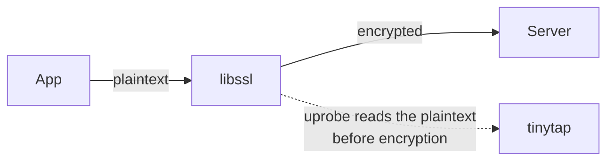
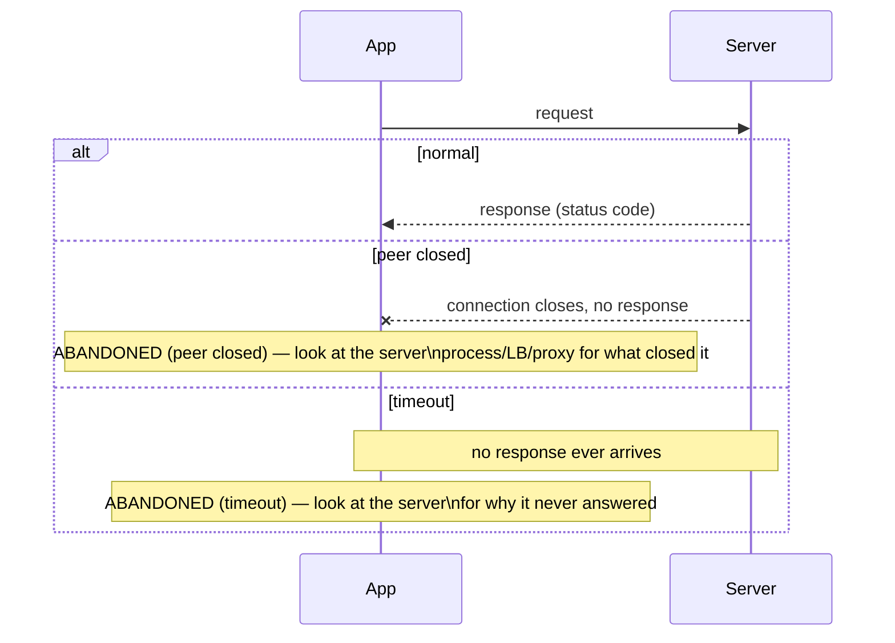
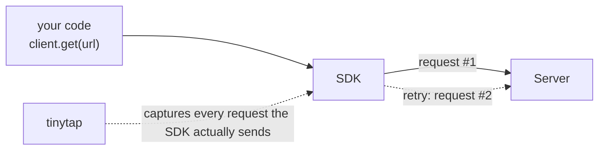
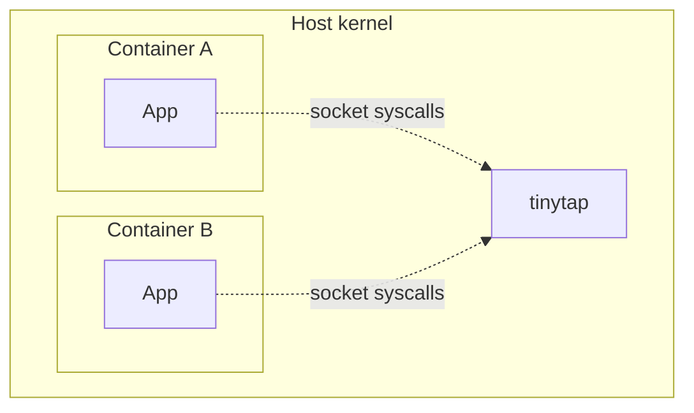
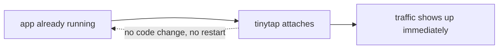

# Use Cases

`tinytap` attaches to a process's socket syscalls and libssl uprobes and
decodes what it sees as HTTP/1.1 — see [How It Works]() for the mechanism. That gives it a few concrete uses
beyond "watch traffic go by."

## See exactly what your app sent, including over HTTPS

An app makes an HTTPS call and you need to know precisely what went out: the
request line, every header (including `Authorization`), the JSON body as
sent. Normally that means a proxy (mitmproxy, Charles) with a CA certificate
installed in the app's trust store — extra setup, and it doesn't work at all
against apps that pin certificates.

`tinytap` reads the outgoing payload (the process's `write`/`sendmsg`, before
TLS encrypts it) directly via libssl uprobes, so there's no proxy and no CA
cert to install — see
[TLS Compatibility]() for which TLS stacks
that covers.

## Diagnose a request that never got a response

A request hangs, or the app reports a failure with no clear cause.
`peer closed` and `timeout` are two different bugs wearing the same
symptom, and telling them apart is what actually narrows down where to
look next.

`peer closed` means something on the other end actively closed the
connection before answering — a crashed or restarting server, a load
balancer or proxy hitting its own idle timeout, a reset somewhere upstream.
`tinytap` also reports how long the connection stayed open before it
closed, which you can match against a specific timeout setting in the
chain — a connection that closes after 5 seconds points somewhere far more
precise than one that runs the full 30.

`timeout` means the connection stayed open the whole time and nothing ever
came back — that points at the server itself: stuck processing,
deadlocked, or waiting on a downstream call that never returns. `tinytap`
gives up waiting after 30 seconds either way, so a `timeout` line's latency
caps out around there; it tells you the server hadn't answered within that
window, not how long it would eventually have taken.

Either way, the line also carries the exact request that went
unanswered — method, path, every header — without adding a single log
line to the app or the server.

## Check what a third-party SDK or library actually sends

Client libraries retry, add headers, or rewrite requests in ways their docs
don't fully spell out. Rather than reading the library's source to guess,
`tinytap` shows the literal bytes it puts on the wire — how many requests a
"single" call actually issues, which header it sends for auth, whether a
retry changes the request at all.

## Debug traffic across container boundaries without a sidecar

eBPF probes attach at the kernel, so `tinytap` sees every process on the
host, containerized or not — no sidecar container, no proxy injected into
the pod. Run it on the host and it captures traffic for containers running
there too; see [Where tinytap Runs]() for the
container story in full.

## Spot-check traffic without touching the app

Sometimes you just want to confirm "did that request actually go out, and
what came back" during local development — without adding a logging
statement, restarting the app, or reaching for a full debugger. `tinytap`
attaches to an already-running process and starts showing traffic
immediately; no app changes, no restart required.

