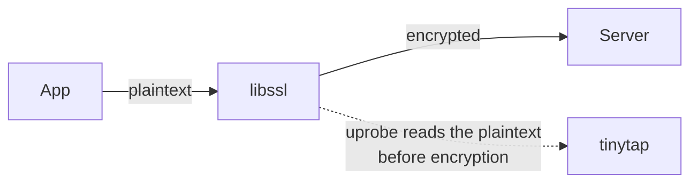
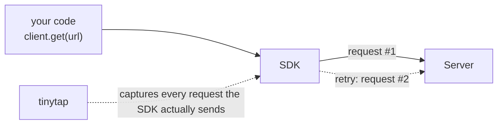
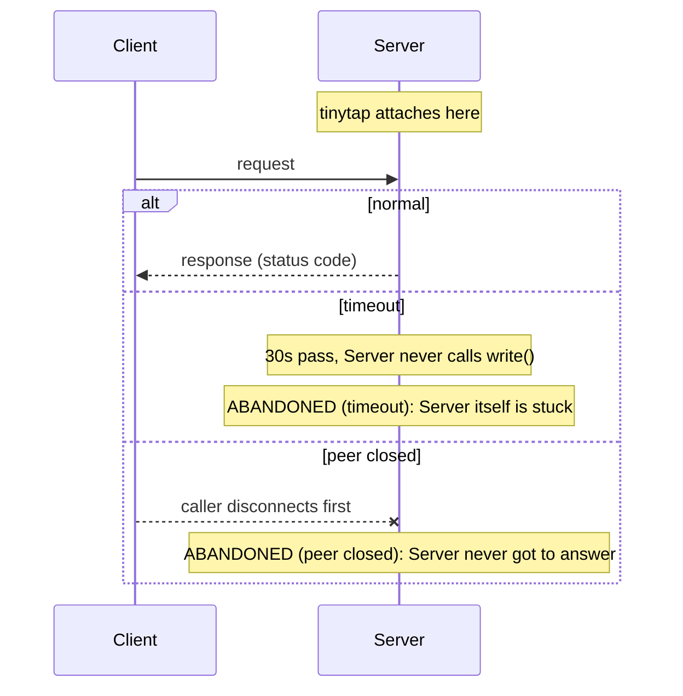
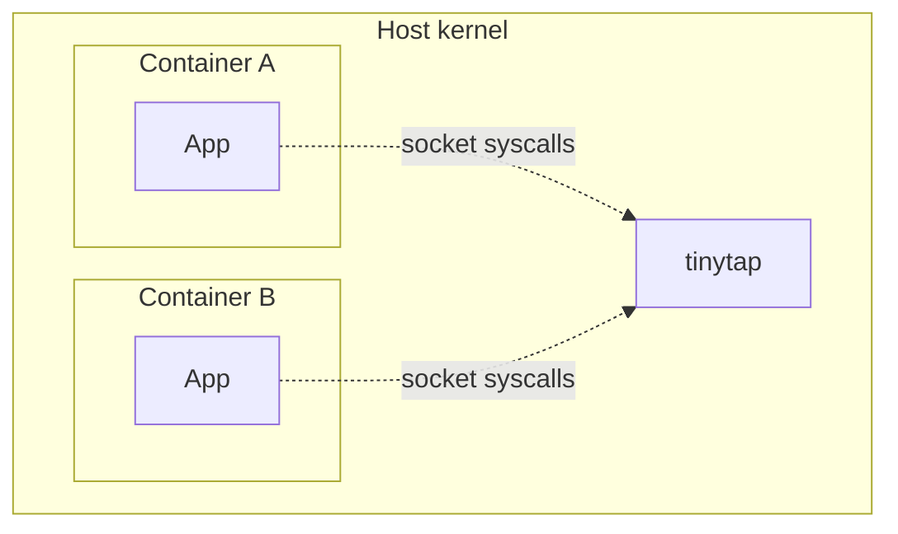
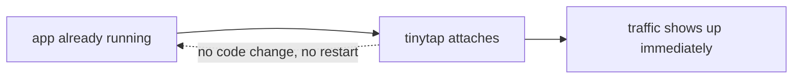

# Use Cases

`tinytap` attaches to a process's socket syscalls and libssl uprobes and
decodes what it sees as HTTP/1.1; see
[How It Works]() for the mechanism. That
gives it a few concrete uses beyond "watch traffic go by."

## See exactly what your app sent, including over HTTPS

An app makes an HTTPS call and you need to know precisely what went out: the
request line, every header (including `Authorization`), the JSON body as
sent. Normally that means a proxy (mitmproxy, Charles) with a CA certificate
installed in the app's trust store, which is extra setup and doesn't work at
all against apps that pin certificates.

`tinytap` reads the outgoing payload (the process's `write`/`sendmsg`, before
TLS encrypts it) directly via libssl uprobes, so there's no proxy and no CA
cert to install. See
[TLS Compatibility]() for which TLS stacks
that covers.

## Check what a third-party SDK or library actually sends

Client libraries retry, add headers, or rewrite requests in ways their docs
don't fully spell out. Rather than reading the library's source to guess,
`tinytap` shows the literal bytes it puts on the wire: how many requests a
"single" call actually issues, which header it sends for auth, whether a
retry changes the request at all.

## Diagnose a request that never got a response

A client reports a hang or a failure with no clear cause, and you own the
server it's calling but can't see why it never answered. Run `tinytap` on
the server, attached to the process handling the request (any of the
servers on the [Server Compatibility]()
list works). `peer closed` and `timeout` are two different failures wearing
the same symptom, and from the server's own socket they're easy to tell
apart.

`timeout` means the server read the request and then never called `write`
on that connection for 30 seconds straight: the request arrived, the
server just never got back to it. That points squarely at the server
process itself, stuck processing, deadlocked, or blocked on a downstream
call that never returns, and since `tinytap` is already running on that
host, you're straight into the process with no need to reproduce the
failure somewhere else.

`peer closed` means the connection died before the server ever wrote a
response. The caller (client, or a load balancer/proxy in between) gave up
and disconnected first. `tinytap` also reports how long the connection
stayed open before that happened: closed after 5 seconds points at a
specific timeout configured somewhere upstream of the server; closed
instantly suggests the server's handler errored out without writing
anything back at all.

Either way, the line also carries the exact request that went
unanswered (method, path, every header) without adding a single log
line to the server.

## Debug traffic across container boundaries without a sidecar

eBPF probes attach at the kernel, so `tinytap` sees every process on the
host, containerized or not, with no sidecar container and no proxy injected
into the pod. Run it on the host and it captures traffic for containers
running there too; see [Where tinytap Runs]()
for the container story in full.

## Spot-check traffic without touching the app

Sometimes you just want to confirm "did that request actually go out, and
what came back" during local development, without adding a logging
statement, restarting the app, or reaching for a full debugger. `tinytap`
attaches to an already-running process and starts showing traffic
immediately; no app changes, no restart required.

